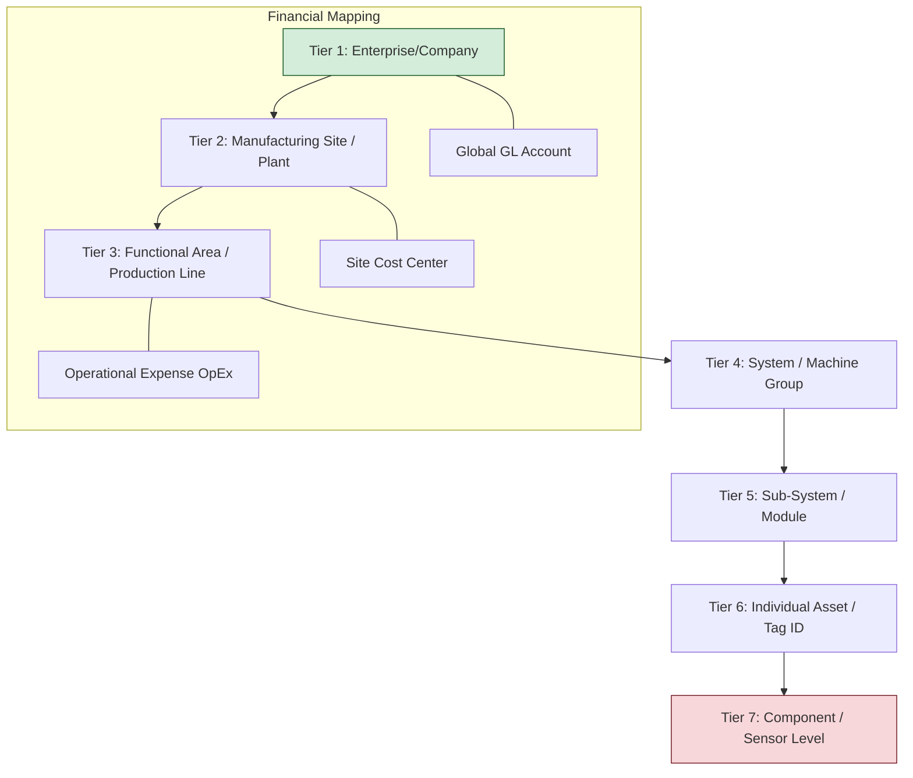

```mermaid
graph TD
    T1[Tier 1: Enterprise/Company] --> T2[Tier 2: Manufacturing Site / Plant]
    T2 --> T3[Tier 3: Functional Area / Production Line]
    T3 --> T4[Tier 4: System / Machine Group]
    T4 --> T5[Tier 5: Sub-System / Module]
    T5 --> T6[Tier 6: Individual Asset / Tag ID]
    T6 --> T7[Tier 7: Component / Sensor Level]

    subgraph "Financial Mapping"
    T1 --- F1[Global GL Account]
    T2 --- F2[Site Cost Center]
    T3 --- F3[Operational Expense OpEx]
    end

    style T1 fill:#d4edda,stroke:#155724
    style T7 fill:#f8d7da,stroke:#721c24
```
