# Product Lifecycle & Engineering Governance Framework
**Domain:** Technical Program Management (TPM) | Agile Governance | Systems Reliability

This repository documents the strategic frameworks and visual project planning methodologies I utilize to lead complex software initiatives from initial discovery to SLA-driven production.

---

## 🚀 The "Zero-to-One" Discovery Phase
For high-growth environments, I treat wireframes as a **Visual Project Plan**. By securing stakeholder alignment on every click-flow and payment link before engineering commits, I eliminate mid-sprint pivots and technical debt.

* **Tooling:** Maven Wireframes & Mockups.
* **Methodology:** Securing "All-Okay" approval on Android activities, button logic, and UI styling prior to development.

---

## ⚖️ The 8/80 Scope Governance Rule
To protect engineering velocity and ensure platform stability, I implemented a 3-tier mathematical model for Change Requests (CRs).

* **Tier 1 (< 8 WH):** Immediate implementation within the current sprint.
* **Tier 2 (8-80 WH):** Planned for final stabilization sprint with associated budget adjustments.
* **Tier 3 (> 80 WH):** Re-scoped as a new project phase to prevent scope creep and protect the core 2-week sprint cycle ($80\text{ Work Hours}$ per developer).

---

## 🛠️ Implementation Workflow
I bridge the gap between design and code by integrating directly into the technical pipeline:
1.  **Discovery:** Translating requirements into high-fidelity mockups.
2.  **Governance:** Enforcing the 8/80 Rule to manage stakeholder expectations.
3.  **Collaboration:** Managing version control and code commits via **Git & Bitbucket**.
4.  **Validation:** Transitioning products into production with strict **SLA-driven support**.

---

## 📜 Certifications & Standards
This framework is built upon **PMP®** project governance and **Lean Six Sigma** efficiency standards to ensure rapid execution without sacrificing reliability.

---

# Product Lifecycle & Governance Framework

📊 **[View Technical TPM Process Flow (tpm process flow.md)]([https://github.com/Hasan-Farooqui-ERP/Product-Lifecycle-Governance/blob/main/tpm%20process%20flow.md](https://github.com/Hasan-Farooqui-ERP/Product-Lifecycle-Governance/blob/main/tpm-process-flow.md))**

```mermaid
graph TD
    T1[Tier 1: Enterprise/Company] --> T2[Tier 2: Manufacturing Site / Plant]
    T2 --> T3[Tier 3: Functional Area / Production Line]
    T3 --> T4[Tier 4: System / Machine Group]
    T4 --> T5[Tier 5: Sub-System / Module]
    T5 --> T6[Tier 6: Individual Asset / Tag ID]
    T6 --> T7[Tier 7: Component / Sensor Level]

    subgraph "Financial Mapping"
    T1 --- F1[Global GL Account]
    T2 --- F2[Site Cost Center]
    T3 --- F3[Operational Expense OpEx]
    end

    style T1 fill:#d4edda,stroke:#155724
    style T7 fill:#f8d7da,stroke:#721c24
```

